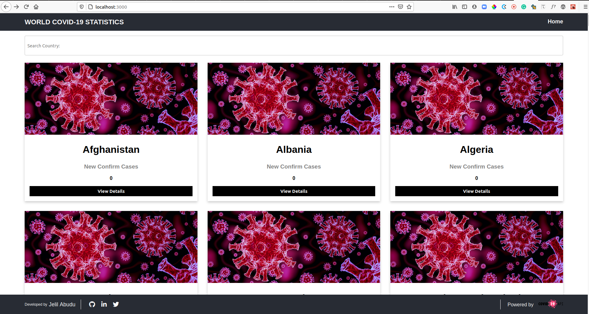
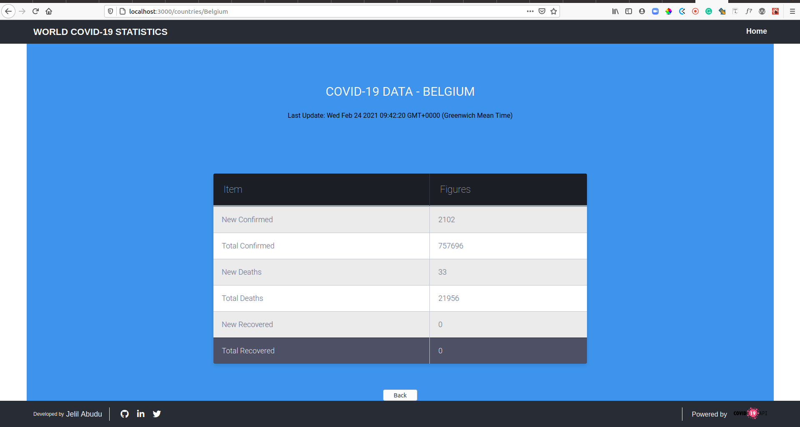

# COVID-19 STATISTICS

## Overview

> The **COVID-19 STATISTICS** app is a web app that gives a summary of updates on the current state of the Covid-19 pandemic across the world. The source of the data is from the [COVID-19 API](https://api.covid19api.com/summary) API. Every country is listed in the app with a detail page that shows the records of that particular country.
> ***Note:*** You may get Zero(0) new confirm cases for your country at a point in time. This because the API is yet to receive the confirm result from your country.
>  
<div align="center">

[](https://github.com/JelilFaisalAbudu/covid19-stats)
[](https://github.com/JelilFaisalAbudu/covid19-stats/issues)
[](https://github.com/JelilFaisalAbudu/covid19-stats/pulls)

</div>

## 📝 Table of Contents

<p align="center">
<a href="#with">Built with</a>&nbsp;&nbsp;&nbsp;|&nbsp;&nbsp;&nbsp;
<a href="#live-demo">Live Demo Link</a>&nbsp;&nbsp;&nbsp;|&nbsp;&nbsp;&nbsp;
<a href="#video-presentations">Video Presentation(s)</a>&nbsp;&nbsp;&nbsp;|&nbsp;&nbsp;&nbsp;
<a href="#available-scripts">Available Scripts</a>&nbsp;&nbsp;&nbsp;|&nbsp;&nbsp;&nbsp;
<a href="#gs">Getting started</a>&nbsp;&nbsp;&nbsp;|&nbsp;&nbsp;&nbsp;
<a href="#author">Author</a>
</p>

## 🔧 Built with<a name = "with"></a>
- ReactJS
- React-Redux
- HTML 5 and CSS 3
- [COVID-19 API](https://api.covid19api.com)

## Screenshots




## Live Demo Link <a name = "live-demo"></a>

## See Live
See live on [Heroku](https://worldcovid19statistics.herokuapp.com/)

## Video Presentation(s) <a name = "video-presentations">

### [Part 1](/)
### [Part 2](/)
## Available Scripts <a name= "available-scripts"></a>

In the project directory, you can run:

### `npm start`

Runs the app in the development mode.\
Open [http://localhost:3000](http://localhost:3000) to view it in the browser.

The page will reload if you make edits.\
You will also see any lint errors in the console.

### `npm test`

Launches the test runner in the interactive watch mode.\
See the section about [running tests](https://facebook.github.io/create-react-app/docs/running-tests) for more information.

### `npm run build`

Builds the app for production to the `build` folder.\
It correctly bundles React in production mode and optimizes the build for the best performance.

The build is minified and the filenames include the hashes.\
Your app is ready to be deployed!

See the section about [deployment](https://facebook.github.io/create-react-app/docs/deployment) for more information.

## Getting Started <a name = "gs"></a>
This project was bootstrapped with [Create React App](https://github.com/facebook/create-react-app).

Make sure you have [Node](https://nodejs.org/en/), installed in your computer.

To get a local copy of the repository please run the following commands on your terminal:

```
$ git clone github.com/JelilFaisalAbudu/covid19-stats.git
```
```
$ cd covid19-stats
```

```
$ npm install
```
```
$ npm start
```

This runs the app in the development mode.
Open [http://localhost:3000](http://localhost:3000) to view it in the browser.

## Testing
This app has been tested using the ```react-testing-library```.
Run ```npm test``` in the console to run the tests.

## ✒️  Authors <a name = "author"></a>

### Author(s)


👤 **Jelil Faisal Abudu**

- Github: [@JelilFaisalAbudu](https://github.com/JelilFaisalAbudu)
- Twitter: [@JelilAbudu](https://twitter.com/jelilabudu)
- Linkedin: [jelilfaisalabudu](https://linkedin.com/in/jelilfaisalabudu)
- Email: [abudujelilfaisal@gmail.com](mailto:abudujelilfaisal@gmail.com)

## 🤝 Contributing

Contributions, issues and feature requests are welcome!

Feel free to check the [issues page](https://github.com/praz99/react-capstone/issues).


## 👍 Show your support

Give a ⭐️ if you like this project!

## :clap: Acknowledgements
- [COVID-19 API](https://api.covid19api.com/)
- [Microverse](https://www.microverse.org/)

## 📝 License

This project is [MIT](./LICENSE) licensed.
